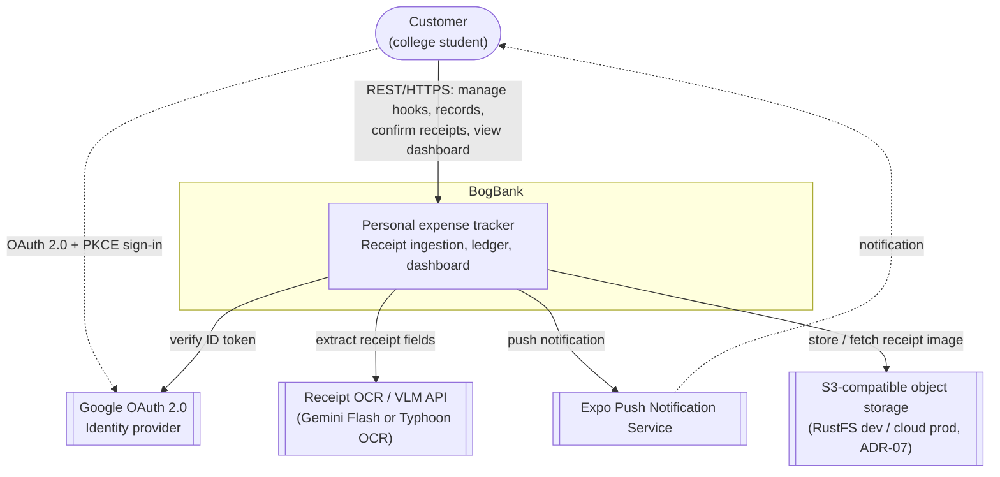
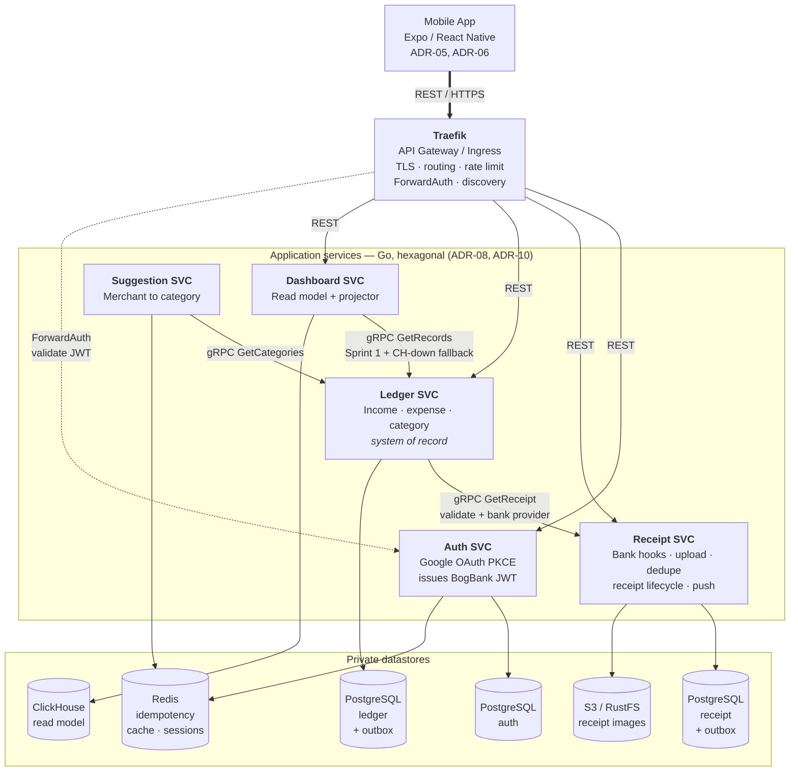
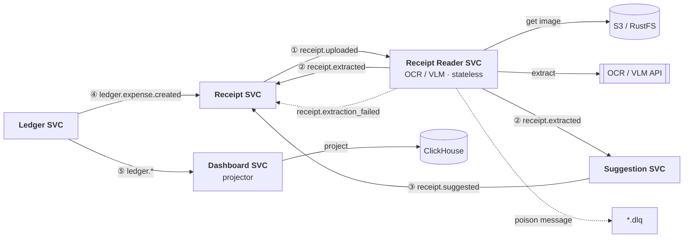
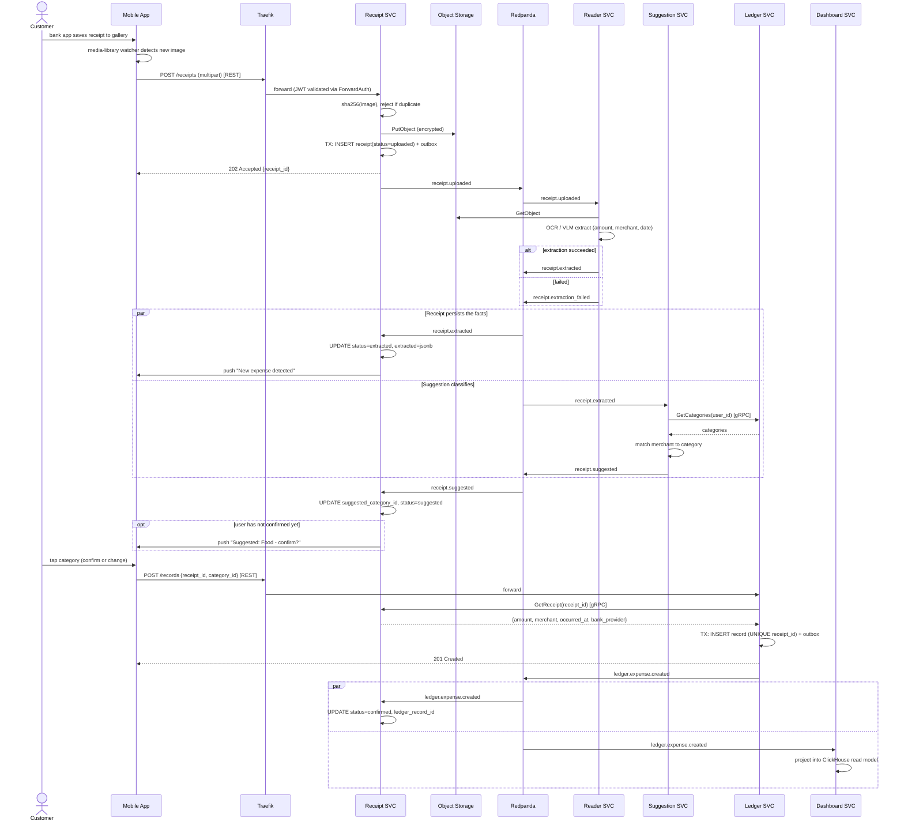
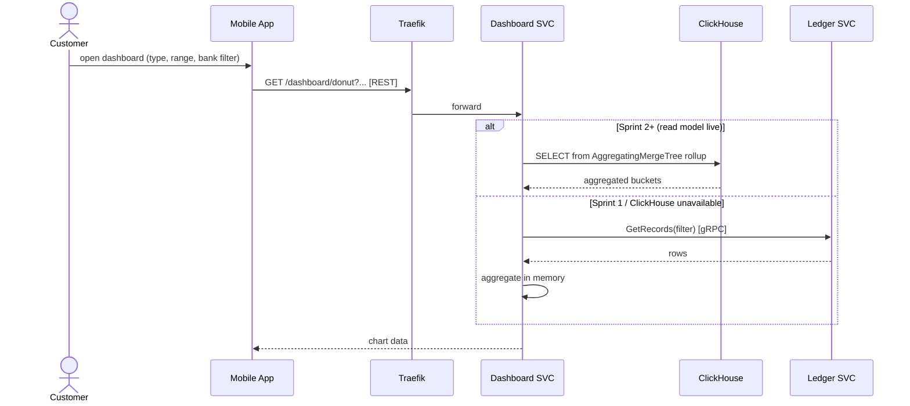

# Architecture Diagram (v2)

Supersedes [architecture-diagram.md](./architecture-diagram.md) (v1).

v1 was a single flowchart. The graded deliverable is the **C4 model across four levels plus sequence
diagrams** (Presentation Guidelines, Part 1), so v2 is structured as C4 instead.

| Level | Scope | Status |
| :---- | :---- | :---- |
| L1 Context | BogBank vs. its users and external systems | This document |
| L2 Container | Services, datastores, infrastructure | This document |
| L3 Component | Internals of Ledger SVC and Receipt SVC | Sprint 2 |
| L4 Code | Hexagonal port/adapter layout (ADR-10) | Sprint 3, one service only |
| Sequence | UC-01 ingest, UC-02 manual, UC-03 dashboard | This document |

---

## Communication style rules

Three rules, applied without exception. They are what makes the style legible in the presentation
and they satisfy three separate course requirements at once.

| Boundary | Style | Why |
| :---- | :---- | :---- |
| Mobile client → system | **REST** (JSON over HTTPS) | Public contract, OpenAPI-documented (ADR-09) |
| Service → service, synchronous | **gRPC** | Typed contracts, internal only, never leaves the cluster |
| Service → service, asynchronous | **Redpanda** (Kafka API) | Choreography, decoupled fan-out, replay |

---

## L1 — System Context



---

## L2 — Container Diagram

Split into two views. Every container appears in both; the split is by *communication style*, which
keeps each diagram readable and maps to one slide each.

### L2a — Synchronous view (REST at the edge, gRPC internally)



Receipt Reader SVC is absent here: it is stateless and purely event-driven, with no synchronous
inbound API. Every consumer also writes idempotency keys to Redis — omitted as edges to keep the
diagram legible, shown in L2b's note.

### L2b — Asynchronous view (Redpanda choreography)



Every labelled edge is a Redpanda topic, never a direct call. Producers publish via the
**transactional outbox**; consumers dedupe on `event_id` in **Redis** because delivery is
at-least-once. Solid = happy path, dotted = failure path.

### Container responsibilities

| Container | Tech | Owns | Talks |
| :---- | :---- | :---- | :---- |
| Traefik | Traefik v3 | Routing, TLS, rate limit, ForwardAuth | — |
| Auth SVC | Go | Users, refresh tokens, JWT signing keys | REST in, gRPC in (token introspection) |
| Receipt SVC | Go | Bank hooks, receipts, extraction results, receipt state machine | REST in, **gRPC in**, Kafka in/out |
| Receipt Reader SVC | Go | Nothing (stateless) | Kafka in/out, HTTP out to VLM |
| Suggestion SVC | Go | Merchant→category rules | Kafka in/out, **gRPC out** to Ledger |
| Ledger SVC | Go | Income, expense, category — **system of record** | REST in, **gRPC in/out**, Kafka out |
| Dashboard SVC | Go | Derived read model only | REST in, Kafka in, **gRPC out** (Sprint 1 + fallback) |

---

## Data ownership and storage

One rule: **a service's datastore is private**. Cross-service reads go through gRPC or events, never
through a shared connection string.

| Service | Store | Shape | Note |
| :---- | :---- | :---- | :---- |
| Auth | PostgreSQL | `users`, `refresh_tokens` | No passwords (NFR1, ADR-03) |
| Receipt | PostgreSQL | `bank_hooks`, `receipts`, `receipt_events`, `outbox` | See below |
| Ledger | PostgreSQL | `categories`, `records`, `outbox` | **System of record, retained forever** |
| Dashboard | ClickHouse | `records_mv` + `AggregatingMergeTree` rollups | **Derived, rebuildable** |
| Suggestion / all | Redis | Consumer idempotency keys, category cache | Required by at-least-once delivery |
| Receipt | S3 / RustFS | Receipt images, SSE-encrypted (NFR3) | ADR-07 |

### Ledger storage: CQRS, not hot/cold tiering

**Postgres keeps every record forever.** ClickHouse is a *projection* of the ledger event stream, not
a second home for old rows. Nothing is ever moved out of Postgres.

Rejected alternative — age-based tiering (PG < 3 months, ClickHouse older):

- FR12's default filters ("current year", "last year") straddle the 3-month boundary, so the common
  path becomes two queries in two SQL dialects merged in application code.
- FR10 allows editing any record. Editing a 4-month-old row means a ClickHouse `ALTER UPDATE` —
  async, non-transactional — instead of a one-line Postgres `UPDATE`.
- The mover job becomes the only copy path: a crash mid-move destroys financial records permanently.
- ClickHouse down means data older than 3 months is *unreachable*, not merely slower.
- The premise doesn't hold: ~3.6k rows/user/year. Postgres with a btree on `(user_id, occurred_at)`
  serves this in single-digit milliseconds. There is no OLTP pressure to relieve.

Under CQRS each of those inverts: one query path, transactional edits, ClickHouse is disposable and
**replayable from Postgres**, and ClickHouse being down degrades the dashboard instead of hiding data.

Explicitly **out of scope**: S3/Iceberg tiering. No justification at this data volume.

### Receipt storage: mutable row + append-only audit trail

Answering "should it be append-only?" — a receipt is a short state machine, so full event sourcing is
overkill. Use both shapes:

```
receipts         (id, user_id, bank_hook_id, image_key, image_sha256,
                  status, extracted jsonb, suggested_category_id,
                  ledger_record_id, created_at, updated_at)
                  UNIQUE (user_id, image_sha256)   -- UC-01 duplicate rule

receipt_events   (id, receipt_id, type, payload jsonb, occurred_at)   -- INSERT only
```

- `status`: `uploaded → extracted → suggested → confirmed`, plus terminal `failed` and `duplicate`.
- `extracted jsonb` absorbs per-bank field variation (KBank and SCB receipts differ) without migrations.
- `receipt_events` is append-only: full audit trail, and it is what you show when asked how the
  async pipeline is debugged.
- `UNIQUE (user_id, image_sha256)` enforces the UC-01 duplicate rule at the database, not in code.

---

## Reliability patterns

These are not optional decoration — they are what makes the event chain correct, and three of them
come straight from the course textbook (Richardson, *Microservices Patterns*).

| Pattern | Where | Problem solved |
| :---- | :---- | :---- |
| **Transactional outbox** | Receipt SVC, Ledger SVC | DB write and event publish are not atomic; a crash between them loses the event. Write both in one transaction, relay the outbox to Redpanda. |
| **Consumer idempotency** | Every consumer | Kafka is at-least-once. Dedupe on `(consumer_group, event_id)` in Redis before handling. |
| **Content-hash dedupe** | Receipt SVC upload | UC-01 duplicate receipt rule, enforced by unique index. |
| **Business-key idempotency** | Ledger `CreateExpense` | `UNIQUE (receipt_id)` — double-tapping the notification cannot create two expenses. |
| **Dead letter topic** | Reader, Suggestion | Extraction failures go to `*.dlq`; receipt is marked `failed` and the user falls back to manual entry (NFR7). |
| **Read-model replay** | Dashboard | ClickHouse rebuilt from Postgres/Kafka; corruption is a routine fix, not an incident. |

---

## Sequence — UC-01: Ingest expense from bank receipt

The main demo path. Note that every arrow is labelled with its style (REST / gRPC / event), which is
the requirement-coverage evidence.



**Why the confirm call goes to Ledger, not Receipt:** Ledger is the authority for expense records, so
the user gets a synchronous `201` confirming the money was recorded. The receipt's own state converges
asynchronously — it is metadata about the ingest pipeline, not the thing the user is waiting on.
`UNIQUE (receipt_id)` makes a double tap a no-op.

## Sequence — UC-03: Dashboard



The `else` branch is not a hack — it is the graceful-degradation path that makes ClickHouse
disposable, and it is how Sprint 1 ships before the read model exists.

---

## Event catalog

| Topic | Producer | Consumers | Key |
| :---- | :---- | :---- | :---- |
| `receipt.uploaded` | Receipt | Reader | `receipt_id` |
| `receipt.extracted` | Reader | Receipt, Suggestion | `receipt_id` |
| `receipt.extraction_failed` | Reader | Receipt | `receipt_id` |
| `receipt.suggested` | Suggestion | Receipt | `receipt_id` |
| `ledger.expense.created` | Ledger | Receipt, Dashboard | `record_id` |
| `ledger.expense.updated` / `.deleted` | Ledger | Dashboard | `record_id` |
| `ledger.income.created` / `.updated` / `.deleted` | Ledger | Dashboard | `record_id` |

Envelope on every event: `event_id` (UUID, the idempotency key), `event_type`, `occurred_at`,
`user_id`, `trace_id` (propagated for observability), `payload`.

Partition key is the entity id so that per-entity ordering holds; `user_id` is available for
future repartitioning.

---

## Service discovery

A required deliverable, answered per environment.

| Environment | Mechanism |
| :---- | :---- | 
| Development | Docker Compose embedded DNS; service name = hostname. Traefik discovers routes from the **Docker provider** via container labels — no static route config. |
| Production (k3s) | Kubernetes `Service` DNS (`<svc>.<ns>.svc.cluster.local`); Traefik discovers routes from the **Kubernetes CRD provider** (`IngressRoute`). |
| Async | Broker-based: producers and consumers only know a topic name, never a peer address. Consumer-group rebalance handles instance membership. |

Client-side discovery and a dedicated registry (Eureka/Consul) were not adopted: the platform already
provides DNS-based server-side discovery in both environments, so a registry would be a component
with no responsibility.

---

## Environments

### Development — Docker Compose profiles

Compose `profiles:` gives exactly the "enable service A and its dependencies" behaviour we want.

```
infra      always on: postgres, redpanda, redis, rustfs, traefik
auth       auth-svc            (+ infra)
receipt    receipt-svc         (+ infra)
reader     reader-svc          (+ infra)
suggest    suggest-svc         (+ ledger, infra)
ledger     ledger-svc          (+ infra)
dash       dashboard-svc       (+ clickhouse, infra)
obs        grafana, prometheus, loki
full       everything
```

Driven by Makefile targets (`make dev SVC=receipt`, `make dev-full`). Go services run under `air`
for hot reload. One Postgres instance, one schema per service — separate schemas preserve the
"private datastore" rule while keeping the laptop footprint to a single container.

### Production — k3s, as a Sprint 3 stretch

Docker Compose on a single VM is the **guaranteed demo path** and must be working end to end first.
k3s is additive:

- Single-node k3s (Traefik ships built in, so the edge config carries over).
- **Kustomize only** — no Helm charts authored by us.
- **One dedicated owner.** CI stays Compose-based so the critical path never depends on k3s.
- Explicitly out of scope: service mesh, multi-node, autoscaling.

Kubernetes is not required by the syllabus — "describe how to manage Service Discovery" is, and
Compose DNS answers it. k3s is taken for the week-12 deployment story, and it is droppable.

### Observability — Grafana stack

Prometheus (metrics) + Loki (logs) + Grafana (dashboards), with OpenTelemetry SDK in every Go service.
Tempo (traces) added only if Sprint 3 allows — distributed tracing across the async chain is the most
compelling observability demo, so it is the first stretch item.

---

## Quality attribute (graded: "1 measurable quality attribute")

**Primary: Performance / Scalability of the ingest pipeline.**
Measured as end-to-end latency from `POST /receipts` to `receipt.suggested`, at p50/p95/p99, under
k6 load. The measurable claim: horizontally scaling Reader SVC consumer instances reduces p95 in
proportion to partition count, until partitions are saturated.

**Secondary: Resilience.** Kill ClickHouse mid-demo; dashboard degrades to the Ledger gRPC path
instead of erroring. Kill Reader SVC mid-demo; restart it and Redpanda replays the backlog with no
lost receipts.

Load tests (two types required):
1. **Constant-arrival-rate load test** on `GET /dashboard/*` — steady-state latency.
2. **Spike/stress test** on `POST /receipts` — queue depth, consumer lag, recovery time.

---

## Requirement traceability

| Course requirement | Satisfied by |
| :---- | :---- |
| ≥3 business use cases + authentication | UC-01, UC-02, UC-03 + Auth SVC |
| Front-end UI live demo | Expo mobile app (ADR-05, ADR-06) |
| ≥1 REST service | All client-facing services (Auth, Receipt, Ledger, Dashboard) |
| ≥1 gRPC service | Ledger→Receipt, Suggestion→Ledger, Dashboard→Ledger |
| ≥1 message broker service | Reader, Suggestion, Receipt, Dashboard (Redpanda) |
| API Gateway | Traefik |
| Service discovery described | Compose DNS / k3s Service DNS / consumer groups (above) |
| ≥2 database types | PostgreSQL (RDBMS) + Redis (NoSQL KV) + ClickHouse (OLAP columnar) |
| Load test, 2 types | Constant-arrival-rate + spike/stress (k6) |
| Risk matrix ≥3 issues | Below |
| 1 measurable quality attribute | Ingest-pipeline performance; resilience secondary |
| C4 four levels + sequence | This document (L1/L2 + sequences); L3/L4 Sprint 2–3 |

---

## Risk matrix (draft — expand to the graded format later)

| # | Risk | Likelihood | Impact | Mitigation |
| :---- | :---- | :---- | :---- | :---- |
| R1 | Thai receipt OCR accuracy is poor | High | High | Use a VLM API (Gemini Flash / Typhoon OCR) not Tesseract; manual entry always available (NFR7); low-confidence extraction leaves the receipt `failed` rather than guessing |
| R2 | Bank apps block screenshots (`FLAG_SECURE`) or use private albums | High | Medium | Documented per-provider support matrix; UC-02 manual fallback; demo with a provider known to work |
| R3 | k3s deployment consumes Sprint 3 and no demo ships | Medium | High | Compose-on-VM is the guaranteed path; k3s is additive with one owner; hard cutoff date |
| R4 | Team unfamiliar with Kafka semantics → lost or duplicated records | Medium | High | Outbox + Redis idempotency from day one; Redpanda to reduce operational load; the week-10 tutorial lands just before Sprint 2 |
| R5 | 7 services for 5 people in 9 weeks | Medium | High | Vertical slice ownership (below); Suggestion stays rule-based; no service mesh, no Iceberg, no tiering |
| R6 | iOS background execution limits break gallery watch | Medium | Medium | Foreground-triggered scan on app open; documented as a known platform constraint |

---

## Proposed work split (5 people, full-stack vertical slices)

Two rules drive this split:

1. **Everyone owns backend microservices.** Nobody is "the frontend person". Project progress is
   graded on per-person GIT contribution three times (5% + 5% + 5%), and every member has to be able
   to answer architecture questions in the 5-minute Q&A about code they actually wrote.
2. **Frontend is sliced, not owned.** Each person builds the screens that consume their own service.
   The Expo app is one codebase but the slices touch disjoint route folders, so they merge cleanly.

| # | Services owned (backend) | Frontend slice | IPC styles they personally implement |
| :---- | :---- | :---- | :---- |
| P1 | **Auth SVC** + Traefik edge config + shared `pkg/outbox`, `pkg/eventbus` | Sign-in / sign-out, token storage, refresh interceptor | REST server, gRPC server (introspection), **Kafka producer/consumer library everyone reuses** |
| P2 | **Ledger SVC** | Income / expense / category CRUD screens | REST server, gRPC server + gRPC client (`GetReceipt`), Kafka producer |
| P3 | **Receipt SVC** | Bank hook management, media-library permission, upload, notification confirm sheet | REST server, gRPC server, Kafka producer **and** consumer |
| P4 | **Dashboard SVC** + ClickHouse projection | Donut chart, bar chart, filter controls | REST server, gRPC client, Kafka consumer |
| P5 | **Receipt Reader SVC** + **Suggestion SVC** + platform (Compose, CI, Grafana, k6) | App shell, navigation, shared UI kit, generated API client | Kafka consumer/producer ×2, gRPC client (`GetCategories`), REST admin API |

Every person ends up having written at least one REST handler, one gRPC endpoint or client, and one
Kafka producer or consumer. That is deliberate: it is the same list the syllabus grades, and it means
any of the five can field any Q&A question.

**Load balance check.** P5's two services are the smallest in the system (Reader is stateless glue
around a VLM call; Suggestion is rule matching) and both land in Sprint 2 — so P5 carries platform
and app shell in Sprint 1, when the others are blocked on scaffolding anyway. P1's Auth SVC is small
after Sprint 1, which is why P1 also owns the shared outbox/eventbus library that Sprint 2 depends on.

**Frontend merge convention.** Each slice owns `app/(tabs)/<slice>/` and registers its routes; the
shell, navigation, theme, and `components/ui/` belong to P5 and change only by PR. The generated
API client is produced from each service's OpenAPI spec (ADR-09), so nobody hand-writes another
person's request types.

**Cross-slice contracts** — protobuf service definitions and the event envelope schema — are agreed
**before** Sprint 1 coding and live in a shared monorepo package. They are the only coupling between
slices, and changing one requires the downstream owner to review the PR.

---

## ADR consequences

| ADR | Status after v2 | Action |
| :---- | :---- | :---- |
| ADR-03 Authentication Pattern | Still valid | Own Auth SVC is exactly what it specifies. Note in the new IdP ADR **why Authelia was rejected**: it implements the OIDC *Provider* role only, cannot federate to Google, and its auth backends store password hashes — contradicting NFR1. |
| ADR-04 Database Technology | **Must be superseded** | It states "PostgreSQL for every service's data store" and explicitly rejects ClickHouse. v2 adds ClickHouse and Redis. Write ADR-11 superseding it. |
| ADR-08 Backend Language | Still valid | Reader SVC stays Go by calling a hosted VLM over HTTP rather than embedding a Python OCR stack. |
| ADR-10 Backend Coding Style | Reinforced | Dashboard's PG→ClickHouse switch is a pure adapter swap behind a port — the payoff this ADR promised. |

New ADRs to write (these close the "Deferred (Tier B)" list in `docs/arch/adr/README.md`):

| # | Title |
| :---- | :---- |
| 11 | Database Technology (supersedes ADR-04) — PostgreSQL + ClickHouse + Redis |
| 12 | Internal IPC Style — gRPC internal, REST at the edge |
| 13 | Message Broker — Redpanda (Kafka API) |
| 14 | API Gateway / Reverse Proxy — Traefik |
| 15 | Identity Provider — own Go Auth SVC (rejects Authelia, Keycloak, Zitadel) |
| 16 | Dev & Prod Environments — Compose profiles, k3s stretch |
| 17 | Observability Stack — Grafana + Prometheus + Loki (+ Tempo) |
| 18 | Ledger Read Model — CQRS, rejects hot/cold tiering |

---

## Open items for the meeting

1. **Redis as the NoSQL store.** The syllabus requires it twice, in those words: §17 "Conduct at
   least 2 types of databases (both RDBMS and No-SQL)" and Presentation Guidelines "one relational
   (RDBMS) and one NoSQL". ClickHouse self-describes as a SQL DBMS, so it is a taxonomy argument we
   would have to win live. Redis is needed anyway for consumer idempotency, so the marginal cost is
   one container. Decide: keep Redis, or accept the risk and drop it.
2. **Notification delivery** currently lives inside Receipt SVC (Expo Push SDK). A separate
   Notification SVC is cleaner but is an eighth service. Recommend: keep it in Receipt SVC, extract
   later only if in-app/email channels appear.
3. **Suggestion SVC algorithm.** Rule-based merchant-string matching is the scoped plan. An LLM call
   would connect to the week 13–14 AI-architecture lectures — decide whether that is worth the
   latency and cost, or whether Reader SVC's VLM already covers the AI narrative.
4. **API composition.** With Traefik-only, Dashboard SVC is the service that performs API
   composition (aggregating Ledger data into chart responses) — that is the answer to give in week 11.
   If the grader wants a distinct composition layer, a thin Go BFF can be added behind Traefik
   without changing any service contract.
