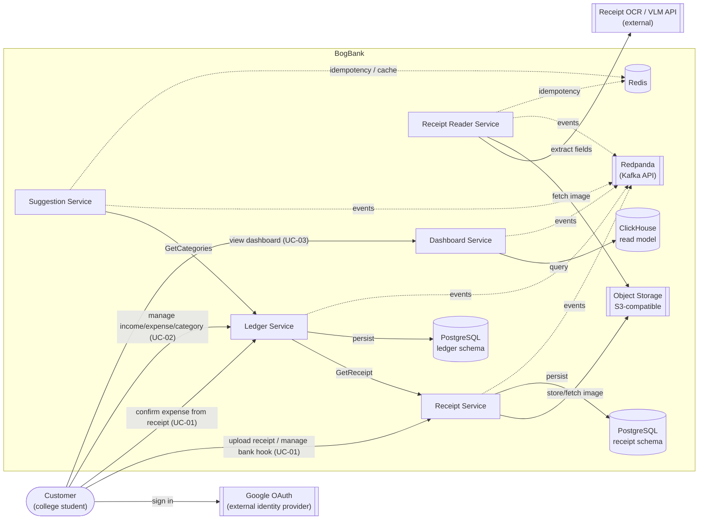

# Architecture Diagram (v2)

Overview of who talks to whom for UC-01 to 03.
More detail: [`c4-model.md`](./c4-model.md). Matching ops table: [`service-operations-collaborators.md`](./service-operations-collaborators.md).

### Arrows

- Solid arrow: A calls B (or writes/reads a store). We do not draw responses.
- Dashed arrow to Redpanda: that service publishes or consumes events. We skip per-topic arrows here; see C4 if you need them.

### Why design it like this

UC-01 is not one request. The app uploads a receipt, something runs OCR, something suggests a category, then the user confirms into Ledger.

We kept those steps as separate services because they are different jobs: Receipt talks to the client and owns receipt state, Reader calls the slow OCR / VLM API, Suggestion only does category matching. That way we can scale each service independently (e.g. a slow OCR run does not slow down receipt uploads, and we can add more Receipt Readers without scaling the Receipt Service).

Services pass work through **Redpanda (Kafka API)** asynchronously instead of calling each other in a long sync chain. **Redis** remembers which events a consumer already handled (Kafka only guarantees at-least-once, so it can deliver twice). **ClickHouse** holds dashboard aggregates so chart reads do not hammer Ledger’s Postgres. Auth and Traefik are not shown here; they are in the C4 docs.

| Piece | Why |
| :---- | :---- |
| **Receipt Reader** | OCR is slow and flaky; keep it off the upload API. |
| **Suggestion** | Category rules should not live inside Receipt storage or Ledger accounting. |
| **Redpanda** | Connects upload → OCR → suggest → ledger/dashboard without tight coupling. |
| **ClickHouse** | Fast chart queries for UC-03 without scanning Ledger row-by-row. |
| **Redis** | Stop double-processing the same event; also a small category cache. |

Receipt images sit in object storage owned by Receipt Service (ADR-07).
