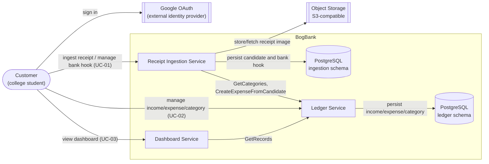

# Architecture Diagram (v1)

For the C4 model (Context → Code) and sequence diagrams, see [`c4-model.md`](./c4-model.md).

```mermaid
flowchart LR
    Customer(["Customer\n(college student)"])
    GoogleOAuth[["Google OAuth\n(external identity provider)"]]
    ObjectStorage[["Object Storage\nS3-compatible"]]

    subgraph System["BogBank"]
        Ingestion["Receipt Ingestion Service"]
        Ledger["Ledger Service"]
        Dashboard["Dashboard Service"]
        IngestionDB[("PostgreSQL\ningestion schema")]
        LedgerDB[("PostgreSQL\nledger schema")]
    end

    Customer -- "sign in" --> GoogleOAuth
    Customer -- "ingest receipt / manage bank hook (UC-01)" --> Ingestion
    Customer -- "manage income/expense/category (UC-02)" --> Ledger
    Customer -- "view dashboard (UC-03)" --> Dashboard

    Ingestion -- "store/fetch receipt image" --> ObjectStorage
    Ingestion -- "persist candidate and bank hook" --> IngestionDB
    Ingestion -- "GetCategories,\nCreateExpenseFromCandidate" --> Ledger
    Dashboard -- "GetRecords" --> Ledger
    Ledger -- "persist income/expense/category" --> LedgerDB
```
