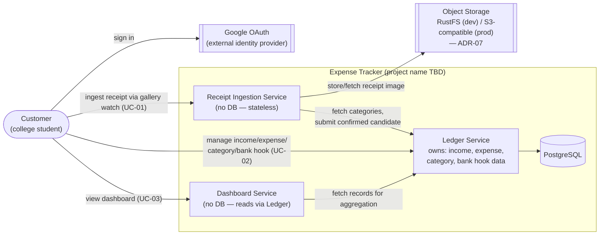

# Architecture Diagram (v1)

Arrows show request/invocation flow: `A --> B` means **A calls B** (per the course convention — no response arrows drawn, no call chains implied that aren't real).

## Notes

- No dedicated Auth/User service in v1 (ADR-03, course convention): each backend service validates the JWT issued after Google OAuth sign-in; the diagram shows Google OAuth as an external system the customer authenticates against directly.
- No API Gateway/reverse proxy shown yet — deferred (ADR Tier B) until service boundaries are stable.
- Receipt Ingestion Service and Dashboard Service intentionally own no data store (per convention: not every service needs a database) — both delegate persistence/source-of-truth to the Ledger Service.
- This is a first iteration; expected to be revised as the design progresses (per course guidance).
