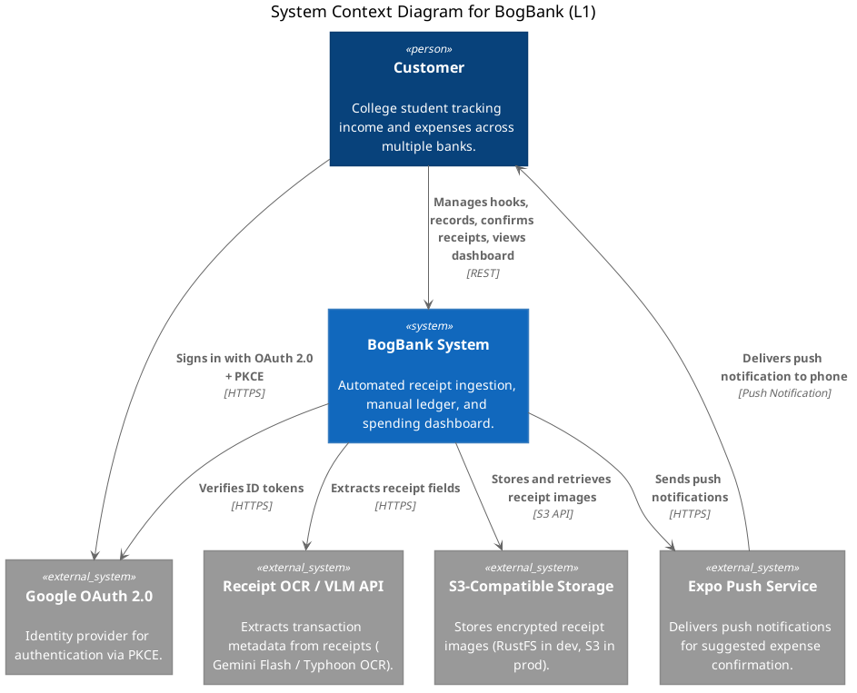
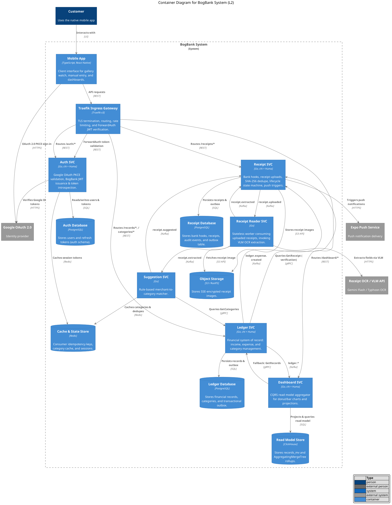
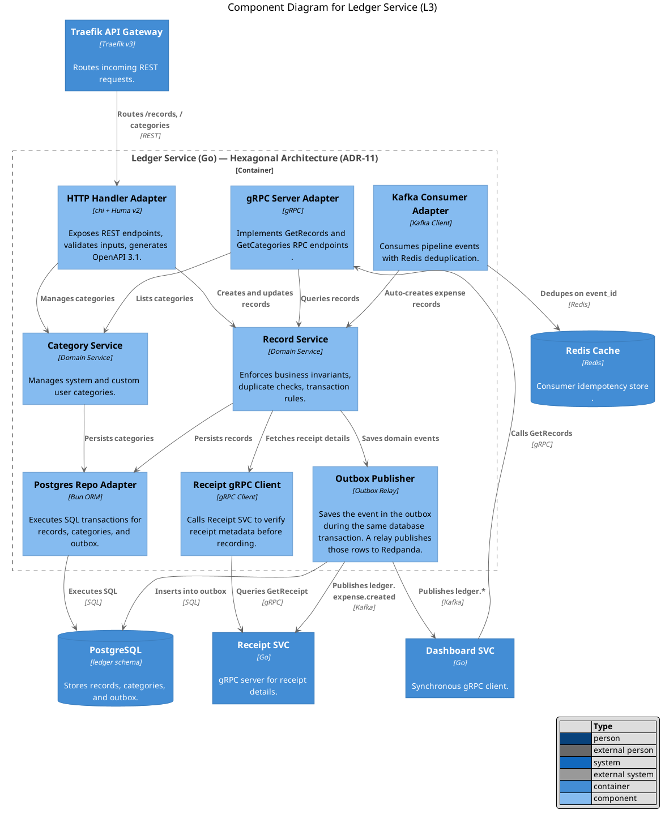
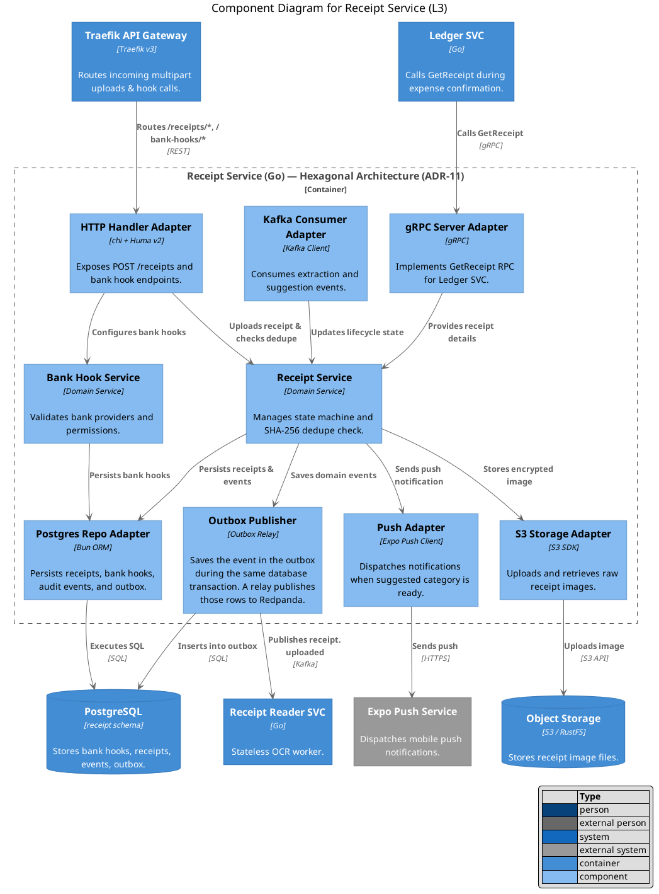
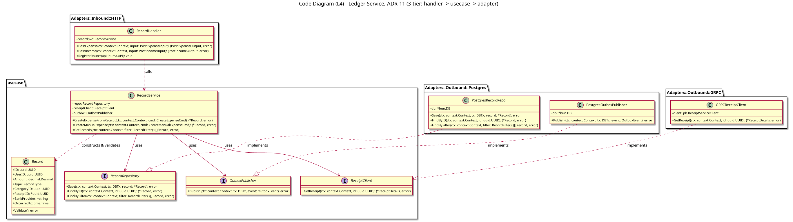
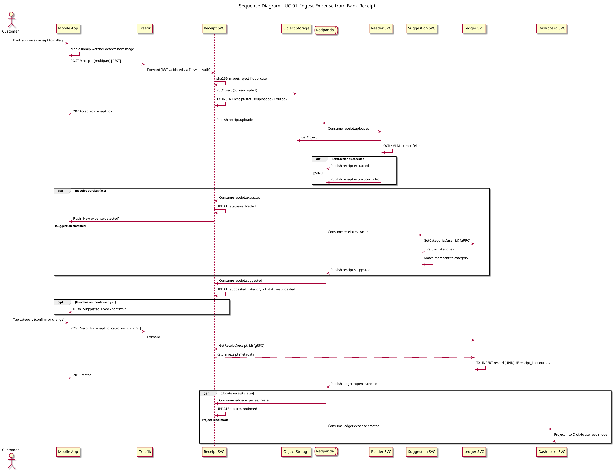
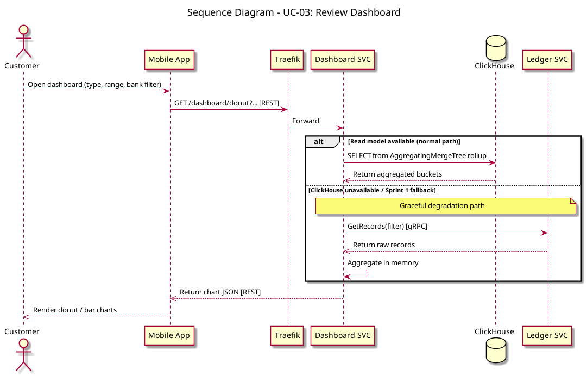

# Architecture Diagram

This document presents the complete C4 architecture model (Context, Container, Component, Code) and core sequence diagrams for the BogBank system.

The canonical diagram source is [`c4-model.puml`](./c4-model.puml). All diagrams are rendered from this file.

For the course-facing overview (Actor / services / UC-labeled request flow), see [`architecture-diagram.md`](./architecture-diagram.md).

---

## Communication style rules

Three rules, applied without exception across system boundaries:

| Boundary | Style | Why |
| :---- | :---- | :---- |
| Mobile client → system | **REST** (JSON over HTTPS) | Public contract, OpenAPI-documented (ADR-09) |
| Service → service, synchronous | **gRPC** | Typed contracts, internal only, never leaves the cluster |
| Service → service, asynchronous | **Redpanda** (Kafka API) | Choreography, decoupled fan-out, replay |

---

## L1 — System Context

BogBank is a personal expense tracking system that interacts with college students and three external systems:
- **Google OAuth 2.0**: Identity provider for PKCE authentication.
- **Receipt OCR / VLM API**: Hosted vision language model (Gemini Flash or Typhoon OCR) for transaction metadata extraction.
- **Expo Push Notification Service**: Push notifications delivered to the mobile client for suggested expense confirmations.

*(Note: S3 / RustFS Object Storage is an internal container owned and managed within the BogBank boundary, so it is modeled at Container level rather than as an external peer system.)*

---

## L2 — Container Diagram

### Container responsibilities

| Container | Tech | Owns | Talks |
| :---- | :---- | :---- | :---- |
| **Traefik** | Traefik v3 | Routing, TLS termination, rate limiting, ForwardAuth | — |
| **Auth SVC** | Go, chi + Huma | Users, refresh tokens, JWT signing keys | REST in, gRPC in (token introspection) |
| **Receipt SVC** | Go, chi + Huma | Bank hooks, receipts, extraction results, receipt state machine | REST in, gRPC in, Kafka in/out |
| **Receipt Reader SVC** | Go | Stateless OCR worker invoking external VLM | Kafka in/out, HTTP out to VLM |
| **Suggestion SVC** | Go | Rule-based merchant-to-category matcher | Kafka in/out, gRPC out to Ledger |
| **Ledger SVC** | Go, chi + Huma | Income, expense, category — **system of record** | REST in, gRPC in/out, Kafka out |
| **Dashboard SVC** | Go, chi + Huma | Derived read model aggregator | REST in, Kafka in, gRPC out (fallback) |

---

## Data ownership and storage

One rule: **a service's datastore is private**. Cross-service reads go through gRPC or events, never through a shared connection string.

| Service | Store | Shape | Note |
| :---- | :---- | :---- | :---- |
| **Auth** | PostgreSQL | `users`, `refresh_tokens` | No passwords (NFR1, ADR-03) |
| **Receipt** | PostgreSQL | `bank_hooks`, `receipts`, `receipt_events`, `outbox` | Append-only audit events + outbox |
| **Ledger** | PostgreSQL | `categories`, `records`, `outbox` | **System of record, retained forever** |
| **Dashboard** | ClickHouse | `records_mv` + `AggregatingMergeTree` rollups | **Derived, rebuildable** |
| **Suggestion / all** | Redis | Consumer idempotency keys, category cache | Required by at-least-once delivery |
| **Receipt** | S3 / RustFS | Receipt images, SSE-encrypted (NFR3) | ADR-07 |

---

## Reliability patterns

These patterns ensure correct asynchronous event processing and fault tolerance across microservices:

| Pattern | Where | Problem solved |
| :---- | :---- | :---- |
| **Transactional outbox** | Receipt SVC, Ledger SVC | DB write and event publish are atomic. Write both in one transaction, relay outbox rows to Redpanda. |
| **Consumer idempotency** | Every consumer | Kafka is at-least-once. Dedupe on `(consumer_group, event_id)` in Redis before handling. |
| **Content-hash dedupe** | Receipt SVC upload | UC-01 duplicate receipt rule, enforced by `UNIQUE (user_id, image_sha256)` index. |
| **Business-key idempotency** | Ledger `CreateExpense` | `UNIQUE (receipt_id)` — double-tapping confirmation cannot create duplicate records. |
| **Dead letter topic** | Reader, Suggestion | Extraction/suggestion failures route to `*.dlq`; receipt marked `failed` for manual fallback (NFR7). |
| **Read-model replay** | Dashboard | ClickHouse rebuilt from Postgres/Kafka; corruption is routine fix, not an incident. |

---

## L3 — Component Diagram (Ledger Service)

The **Ledger Service** is the financial system of record. Consistent with **ADR-11 (Backend Coding Style v2)** and **ADR-09 (chi + Huma v2)**, it adopts a 3-tier architecture (`handler → usecase → adapter`).

---

## L3b — Component Diagram (Receipt Service)

The **Receipt Service** is the asynchronous ingestion engine handling image uploads, deduplication, state transitions, and push triggers.

---

## L4 — Code Diagram (Ledger Service: ADR-11 3-Tier Layout)

Zooming into the code structure of the `Record` package within `Ledger SVC`. Per **ADR-11 (Backend Coding Style v2: 3-tier handler -> usecase -> adapter)**, handlers invoke use cases directly, while outbound infrastructure dependencies remain interface-based ports.

---

## Sequence — UC-01: Ingest expense from bank receipt

The main asynchronous receipt ingestion and category suggestion pipeline:

- **Synchronous user acknowledgment**: The user gets a synchronous success once Ledger persists the financial record. Receipt state converges asynchronously via `ledger.expense.created`.
- **Duplicate protection**: Image-hash dedupe at upload; `UNIQUE (receipt_id)` on the ledger table makes double-tap confirmation a no-op.
- **Reliability**: Receipt and Ledger writes use the transactional outbox so DB commit and event publish stay atomic.

---

## Sequence — UC-03: Dashboard

Dashboard query path with a ClickHouse read model and gRPC degradation fallback:

- **Graceful degradation**: If ClickHouse is unavailable or before the OLAP read model is ready, Dashboard SVC falls back to `GetRecords` gRPC on Ledger SVC and aggregates in memory.
- **Rollups**: ClickHouse `AggregatingMergeTree` (see Data ownership).

---

## Event catalog

| Topic | Producer | Consumers | Key |
| :---- | :---- | :---- | :---- |
| `receipt.uploaded` | Receipt SVC | Reader SVC | `receipt_id` |
| `receipt.extracted` | Reader SVC | Receipt SVC, Suggestion SVC | `receipt_id` |
| `receipt.extraction_failed` | Reader SVC | Receipt SVC | `receipt_id` |
| `receipt.suggested` | Suggestion SVC | Receipt SVC | `receipt_id` |
| `ledger.expense.created` | Ledger SVC | Receipt SVC, Dashboard SVC | `record_id` |
| `ledger.expense.updated` / `.deleted` | Ledger SVC | Dashboard SVC | `record_id` |
| `ledger.income.created` / `.updated` / `.deleted` | Ledger SVC | Dashboard SVC | `record_id` |

Envelope on every event: `event_id` (UUID, idempotency key), `event_type`, `occurred_at`, `user_id`, `trace_id` (observability), `payload`. Partition key is entity ID for strict per-entity ordering.
